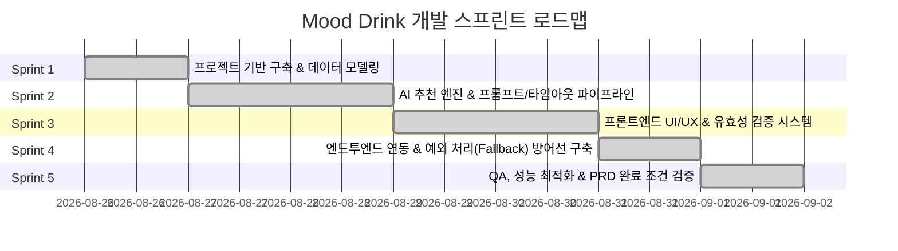

# 🍷 기분 기반 맞춤형 주종/안주 추천 서비스 (Mood Drink) 개발 계획서

본 문서는 프로젝트 루트의 `PRD.md`에 명시된 모든 요구사항과 성공 조건을 100% 충족하도록 수립된 단계별 스프린트(Sprint) 개발 계획서입니다. 향후 개발 진행 상황 및 마일스톤 관리를 위해 체계적으로 운영됩니다.

---

## 📌 1. 프로젝트 개요 및 PRD 요구사항 분석

### 1.1 프로젝트 목표
- 지친 하루(코딩 과제, 헬스, 러닝 등 방전된 상태)를 보낸 사용자의 기분/상황 텍스트를 분석하여, **위로/공감 멘트(1~2문장) + 맞춤 주종(1개) + 맞춤 안주(1개)**를 신속하고 정확하게 추천합니다.

### 1.2 핵심 성공 지표 및 제약사항
| 항목 | 요구 사양 |
| :--- | :--- |
| **추천 응답 구조** | 공감 멘트 1개(1~2문장), 주종 1개, 안주 1개 (구조화된 JSON) |
| **응답 시간 제한** | **최대 3초 (3,000ms)** (초과 시 즉시 Timeout 처리 및 Fallback 전환) |
| **입력 유효성 검증** | 빈칸(0자) / 5자 미만 차단, 최대 300자 입력 제한 및 Truncate |
| **안정성 (Fail-safe)** | AI 에러(5xx, 파싱 실패, 타임아웃) 발생 시에도 화면 깨짐 없이 Fallback 결과 또는 안내 메시지 제공 |
| **재시도 지원** | 추천 완료 후 언제든지 재추천 가능 |

---

## 🏗️ 2. 기술 스택 및 아키텍처

- **Framework**: Next.js 16+ (App Router)
- **Language**: TypeScript (엄격한 타입 안전성 보장)
- **Styling**: Tailwind CSS v4, Lucide React (아이콘)
- **Data Validation**: Zod (AI 응답 스키마 검증 및 방어적 파싱)
- **AI Integration**: AI Provider API (Gemini API / OpenAI API 연동 Route Handler)
- **State Management**: React 19 Hooks (`useState`, `useTransition`, `useRef`)

---

## 🚀 3. 스프린트별 상세 개발 계획

### 📌 스프린트 진행 현황 요약
| 스프린트 | 목표 | 상태 | 주요 산출물 |
| :--- | :--- | :---: | :--- |
| **Sprint 1** | 프로젝트 기반 구축 & 데이터 모델링 | **완료 (Done)** | `lib/types.ts`, `lib/schema.ts`, `.env.example` |
| **Sprint 2** | AI 추천 엔진 & 타임아웃/Fallback 파이프라인 | **완료 (Done)** | `lib/ai.ts`, `lib/fallback.ts`, `app/api/recommend/route.ts` |
| **Sprint 3** | 프론트엔드 UI/UX & 유효성 검증 시스템 | **완료 (Done)** | `components/input-section.tsx`, `components/recommendation-card.tsx`, `app/page.tsx` |
| **Sprint 4** | E2E 연동 & 예외 처리(Fallback) 방어선 | **완료 (Done)** | `hooks/use-recommendation.ts`, `components/error-toast.tsx`, `app/page.tsx` |
| **Sprint 5** | QA, 성능 최적화 & PRD 완료 조건 검증 | **완료 (Done)** | `docs/sprint-5/QA_REPORT.md`, `app/layout.tsx` |

---

### 🔹 [Sprint 1: 프로젝트 기반 구축 & 데이터 모델링](file:///c:/mood-based-drink-recommender/docs/sprint-1/README.md)
> 📁 상세 문서: [docs/sprint-1/README.md](file:///c:/mood-based-drink-recommender/docs/sprint-1/README.md)  
> **목표**: 일관된 데이터 구조 정의, 환경 설정 및 백엔드 API 엔드포인트 골격 구축

- [x] **Task 1.1**: 프로젝트 환경 변수 및 AI SDK 의존성 설정
  - `.env.local` 및 `.env.example` 템플릿 구성 (`AI_API_KEY`, `AI_MODEL` 등)
  - 데이터 유효성 검증 패키지 설치 (`zod`)
- [x] **Task 1.2**: 공통 데이터 인터페이스 및 스키마 정의 (`lib/types.ts`, `lib/schema.ts`)
  - `RecommendationRequest` (텍스트 등)
  - `RecommendationResponse` (`comfort`, `drink`, `snack`, `isFallback`)
  - `ApiError` (`code`, `message`, `retryable`)
  - `requestSchema`, `recommendationResultSchema`
- [x] **Task 1.3**: Next.js Route Handler 생성 (`app/api/recommend/route.ts`)
  - POST 요청 파싱 및 기본 응답 뼈대 구축
  - 클라이언트 입력값 기본 유효성 검사 로직 및 테스트 완료

---

### 🔹 [Sprint 2: AI 추천 엔진 & 프롬프트/타임아웃 파이프라인](file:///c:/mood-based-drink-recommender/docs/sprint-2/README.md)
> 📁 상세 문서: [docs/sprint-2/README.md](file:///c:/mood-based-drink-recommender/docs/sprint-2/README.md)  
> **목표**: PRD 요구 조건을 강제하는 프롬프트 엔지니어링, 3초 타임아웃 제어 및 Fail-safe 엔진 개발

- [x] **Task 2.1**: AI 프롬프트 엔지니어링 및 JSON Structured Output 강제
  - 사전 지식 기반의 주종 1개, 안주 1개, 공감 멘트 1~2문장 출력 규칙 시스템 프롬프트 작성
  - Zod / JSON Schema를 통한 응답 포맷 강제
- [x] **Task 2.2**: 3초 타임아웃 제어(Timeout Controller) 구현
  - `AbortController`를 활용하여 3,000ms 초과 시 요청 자동 중단
- [x] **Task 2.3**: 기본 추천값(Fallback Engine) 구현
  - AI 파싱 실패, 타임아웃, 서버 오류 발생 시 제공할 고품질 Fallback 데이터셋 정의
  - 기본값 예시: "AI가 너무 깊게 고민하네요! 오늘은 무조건 시원한 맥주와 치킨을 추천합니다."

---

### 🔹 [Sprint 3: 프론트엔드 UI/UX & 유효성 검증 시스템](file:///c:/mood-based-drink-recommender/docs/sprint-3/README.md)
> 📁 상세 문서: [docs/sprint-3/README.md](file:///c:/mood-based-drink-recommender/docs/sprint-3/README.md)  
> **목표**: PRD 화면 명세를 완벽히 반영한 인터랙티브 UI 컴포넌트 개발

- [x] **Task 3.1**: 사용자 입력 영역 및 글자 수 카운터 고도화
  - 300자 입력 제한 물리적 방어 (`maxLength={300}`) 및 실시간 카운터 (`text.length / 300`)
  - 300자 초과 텍스트 붙여넣기 시 자동 Truncate 처리
- [x] **Task 3.2**: 유효성 검사 및 에러 경고 UI 구현
  - 0자(빈칸) 입력 시: 입력창 붉은 테두리 + "오늘 하루를 짧게라도 들려주세요!" 경고 멘트 표시
  - 5자 미만 입력 시: "조금 더 자세히 들려주세요!" 경고 멘트 표시
  - 정상 입력 시 실시간 경고 해제
- [x] **Task 3.3**: 액션 버튼 및 로딩 인터랙션 구현
  - 기본 상태: `추천받기` (결과 존재 시 `다시 추천받기`)
  - 로딩 상태: `고민 중...` 텍스트 + `LoaderCircle` 스피너 표시 및 버튼 `disabled` 처리
- [x] **Task 3.4**: 결과 카드(Result Card) 컴포넌트 고도화
  - 기본 상태: 숨김 (`result === null`)
  - 결과 출력: 공감 멘트 카드, 주종 카드, 안주 카드 3단 그리드 레이아웃
  - 부드러운 전환 애니메이션 (Fade-in, Slide-in) 적용

---

### 🔹 [Sprint 4: 엔드투엔드 연동 & 예외 처리 방어선 구축](file:///c:/mood-based-drink-recommender/docs/sprint-4/README.md)
> 📁 상세 문서: [docs/sprint-4/README.md](file:///c:/mood-based-drink-recommender/docs/sprint-4/README.md)  
> **목표**: 프론트엔드와 백엔드 API 연동 및 PRD 5번 항목의 예외 처리 시나리오 완벽 대응

- [x] **Task 4.1**: 클라이언트 API 호출 훅 / 핸들러 연동
  - `fetch('/api/recommend')` 연동 및 비동기 상태 관리 (`hooks/use-recommendation.ts`)
- [x] **Task 4.2**: 3초 타임아웃 및 Fallback 렌더링 검증
  - 3초 초과 시 프론트엔드에서 사용자 친화적 Fallback 화면 자동 노출
- [x] **Task 4.3**: 네트워크/서버 오류 알림 처리
  - 5xx 에러 또는 네트워크 단절 시 토스트/경고 배너 노출: "일시적인 연결 문제가 발생했습니다. 잠시 후 다시 시도해 주세요."
  - 에러 발생 후 '추천받기' 버튼 즉시 재활성화
- [x] **Task 4.4**: AI 파싱 에러 방어 로직 (UI Protection)
  - 비정상적인 줄글이나 깨진 데이터 수신 시에도 UI 크래시 없이 안전하게 Fallback으로 대체 렌더링

---

### 🔹 [Sprint 5: QA, 성능 최적화 & PRD 완료 조건 검증](file:///c:/mood-based-drink-recommender/docs/sprint-5/README.md)
> 📁 상세 문서: [docs/sprint-5/README.md](file:///c:/mood-based-drink-recommender/docs/sprint-5/README.md)  
> **목표**: PRD 6대 완료 조건 전수 점검, 반응형/접근성 검증 및 배포 준비

- [x] **Task 5.1**: PRD 6대 완료 조건 전수 검증 (Verification Checklist)
  - [x] 1. 사용자가 텍스트를 입력하고 버튼을 누르면 결과(주종 1개, 안주 1개, 공감 멘트)가 정상 출력되는가?
  - [x] 2. 빈 입력(0자) 또는 5자 미만일 때 조건별 안내 문구가 붉은색으로 표시되는가?
  - [x] 3. 300자 입력 제한이 정확하게 동작하는가?
  - [x] 4. AI 처리 중일 때 '고민 중...' 및 로딩 스피너가 표시되는가?
  - [x] 5. 3초 초과(타임아웃), 네트워크 오류, 파싱 실패 시 화면이 죽지 않고 Fallback/안내 문구가 정상 작동하는가?
  - [x] 6. 결과 확인 후 언제든 '다시 추천받기' 버튼으로 재시도가 가능한가?
- [x] **Task 5.2**: 반응형 디자인 및 접근성(A11y) 점검
  - 모바일, 태블릿, 데스크톱 화면 비율 최적화
  - `aria-live`, `role="alert"`, 스크린 리더 호환성 점검
- [x] **Task 5.3**: 빌드 및 배포 검증 (`npm run build` 무결성 확인)

---

## 📊 4. PRD 요구사항 추적 매트릭스 (Traceability Matrix)

| PRD 요구사항 | 관련 스프린트 | 주요 구현 컴포넌트/파일 | 완료 기준 |
| :--- | :---: | :--- | :--- |
| **목표 & 성공 조건** (주종 1개, 안주 1개, 공감 멘트) | Sprint 1, 2, 3 | `lib/types.ts`, `lib/ai.ts`, `components/recommendation-card.tsx` | AI 응답에 3가지 요소 필수 포함 & 카드 렌더링 |
| **입력창 & 글자 수 제한** (최대 300자) | Sprint 3 | `components/input-section.tsx`, `app/page.tsx` | 300자 제한 및 카운터 UI |
| **입력 유효성 검증** (0자, <5자 빨간 경고) | Sprint 3 | `components/input-section.tsx`, `lib/schema.ts` | 조건별 경고 텍스트 & 붉은 테두리 강조 |
| **로딩 상태 표시** ('고민 중...', 스피너) | Sprint 3 | `components/input-section.tsx` | 버튼 텍스트 변경 및 disabled |
| **3초 타임아웃 & Fallback** | Sprint 2, 4 | `lib/fallback.ts`, `lib/ai.ts`, `hooks/use-recommendation.ts` | 3초 초과 시 맥주/치킨 기본값 노출 |
| **네트워크/서버 에러 대응** (재시도 안내) | Sprint 4 | `components/error-toast.tsx`, `hooks/use-recommendation.ts` | 에러 배너 안내 후 버튼 즉시 재활성화 |
| **UI 보호 & 재시도 가능** | Sprint 4 | `hooks/use-recommendation.ts`, `app/page.tsx` | 파싱 실패 방어 & 상시 재추천 가능 |

---

## 📝 5. 문서 관리 및 업데이트 원칙

1. **상태 관리**: 각 Task 완료 시 `[ ]`를 `[x]`로 체크하여 진행률을 가시화합니다.
2. **이슈 및 변경 관리**: 개발 중 PRD 변경이나 추가 요구사항이 발생할 경우 본 문서의 해당 스프린트 항목을 갱신하고 버전 이력을 기록합니다.
